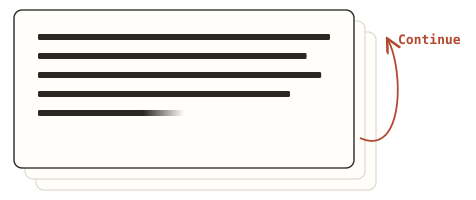

# unfold-chat

As frontier models get better, I find myself caring more about what they say.
It is not rare for almost an entire answer to be interesting, raise follow-ups,
or contain something I want to push back on.

The answer grows into one long wall, but the interface gives me only one
response box for the whole thing. I have to start at the top and work through
it, copying interesting passages into the box, adding commentary, and continuing
to read. By the time I reach the end, my response has accumulated several
snippets and commentaries. I send that whole bundle at once, and the model now
has to answer all of those threads in one response—usually producing an even
longer, more complex wall. Then the whole thing snowballs.

Unfold is a small interaction experiment around that friction. It treats the
model's user-facing answer less like one monolithic object and more like
something I can read and interact with as it unfolds:

<p align="center">
  
</p>

The word I keep coming back to is ergonomics. A model can be brilliant, but if its answer is tiring to read, the conversation still feels like work. The practical goal here is basically: make the answer easier to read and the conversation easier to participate in.

## The three experiments

The root page (`/`) is the original speculative-continuation version.

- `/` — speculative continuation. The first paragraph is live; later paragraphs
  are buffered until Continue or an empty Enter.
- `/annotation` — the complete answer is visible. Select passages, attach
  multiple notes, and respond to the annotations instead of copypasting quotes
  into the composer.
- `/mixed` — speculative continuation plus annotations on the visible frontier.
- `/trajectories` — replay a real agent trace, then compare a standard answer with Unfold v1.

## A deliberate constraint

By default, the request is as close as possible to a normal chat completion:
there is no custom system prompt telling the model how to behave. The server
uses a small paragraph-boundary heuristic to decide what can be revealed.

There's also an optional **guided** toggle. Guided mode adds one small
cohesion instruction and folds short transition sentences into the section they
introduce.

## Run it

Zero dependencies. Requires Node >= 18.

```sh
# OpenAI-compatible default
OPENAI_API_KEY=your-key-here node server.js

# Any OpenAI-compatible endpoint
node server.js -m my-model -b https://example.com/v1 -k MY_API_KEY

# Ollama
node server.js -b http://localhost:11434/v1 -m llama3.1

# llama.cpp / LM Studio
node server.js -b http://localhost:1234/v1 -m my-model

# Gemini's OpenAI-compatible endpoint
node server.js -m <gemini-model-id> \
  -b https://generativelanguage.googleapis.com/v1beta/openai \
  -k GEMINI_API_KEY
```

## Hosted demo (BYO quota)

`server.js` is the self-host path. To share a link instead, deploy the same app
as a single Worker (`worker.js`) that serves `app/` and implements `/api/*`
against Workers AI:

- The first `FREE_PER_VISITOR` messages per visitor run on the host's account
  (per-visitor daily counter + global daily ceiling in KV). Worst case abuse
  burns only the owner's free daily neurons, never paid quota.
- After that, the visitor connects their own Cloudflare account — OAuth PKCE,
  same pattern as [byo-quota](https://github.com/ob1-s/byo-quota) — and
  inference is relayed with *their* bearer to *their* account. No login wall
  before trying; no mock streams.
- Turn state lives in a Durable Object; the SSE wire protocol is identical to
  `server.js`, so the frontend needs nothing beyond the connect banner.

```sh
wrangler kv namespace create QUOTA   # paste the id into wrangler.toml
# optional: reuse the OAuth client from byo-quota and set CLIENT_ID in [vars]
#           (redirect_uris / allowed_cors_origins must include your deploy URL)
wrangler secret put QUOTA_SALT       # optional, per-visitor hash salt
wrangler deploy
```

Model note: Workers AI free-tier models are weaker than frontier APIs; the
buffering/reveal interaction is the thesis of the demo, not the prose. BYO
visitors on a paid plan get bigger models through the same path.

